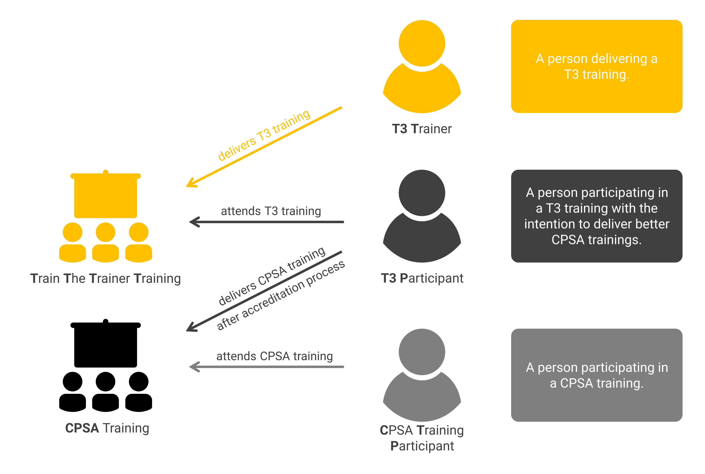

// tag::EN[]
=== Important terms and concepts

Communicating about requirements on trainers for a train-the-trainer course training other trainers comes as confusing as it gets. 
Therefor we have to clarify the basic concepts and terms right from the start:

Learning Unit (LU):: A distinct section of the curriculum that focuses on a specific topic or set of related topics. Most Learning Units are designed to be taught as cohesive blocks, typically lasting several hours. However, LU02 (Mastering and Conveying the FL Curriculum), is cross-cutting and integrated throughout the course rather than taught as a single block. Each Learning Unit comprises multiple Learning Goals.

Learning Goal (LG):: A specific, measurable outcome that participants should achieve by the end of a Learning Unit or, in the case of cross-cutting units, by the end of the course. Learning Goals describe the knowledge, skills, or competencies that participants should gain.

Train-the-Trainer (T3):: As we will use the term "Train-the-Trainer" extensively, it makes sense to abbreviate it to "T3", as in T3 trainer, T3 training, etc.

T3 training, Train-the-Trainer training, T3 course:: A T3 training or T3 course enables (future) trainers to efficiently and effectively deliver iSAQB-accredited trainings. This curriculum describes the contents of such a training.

T3 trainer:: A person delivering a T3 training.

T3 participant (T3P):: A person participating in a T3 training with the intention to deliver better CPSA (Certified Professional for Software Architecture) trainings.

CPSA training:: Any iSAQB accredited Foundation Level (CPSA-F^(R)^) or Advanced Level (CPSA-A^(R)^) training. Most T3P will attend a T3 training to get started delivering FL trainings.

CPSA student, student, CPSA training participant (CTP):: We are going to use the term "student" or "CPSA student" exclusively for referring to persons attending a CPSA training (the future customers of the T3P) in order to distinguish them from T3 participants.

[#img-t3-context] 

[TIP]
====
If you become confused or got lost in abstraction, just recall:
This curriculum describes how to deliver a T3 training.
A T3 training teaches how a CPSA training should be conducted.
====

// end::EN[]
