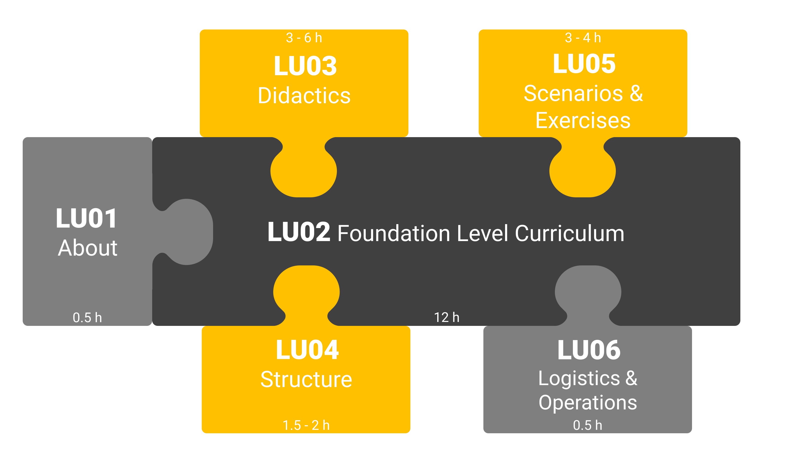

// tag::EN[]
=== Curriculum Structure and Recommended Durations

TODO: Describe overall structure and that it is divided into learning Units
- describe how everything ties into LU02

[#img-t3-learning-units] 

[cols="<,>", options="header"]
|===
| Content
| Recommended minimum duration (minutes)
| LU01 - About iSAQB Trainings and Trainers  | 30-60
| LU02 - Mastering and Conveying the FL Curriculum | 720
| LU03 - Didactics, Methods, Tools and Best Practices  | 240-360
| LU04 - Structure and Planning | 90-120
| LU05 - Designing and Evaluating Example Scenarios and Exercises | 180-240
| LU06 - Operational Aspects (optional) | 0-60
| |
| Total | 1260-1560 (21-26h)

|===

// end::EN[]

// tag::REMARK[]
//
// end::REMARK[]
